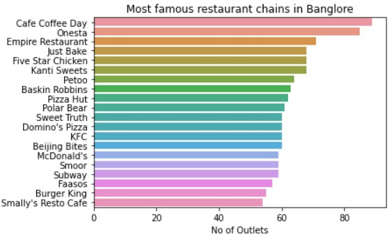
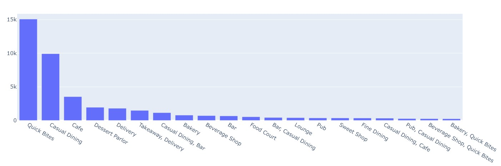

# Zomato Geo Spatial Data Analysis

### Overview

Zomato, an India-based restaurant aggregation and meal delivery service, operates globally, offering extensive eatery details and customer reviews. The project's objective is to uncover data irregularities, enabling accurate assessment of business performance for Zomato's owners.

Agenda is to analyze 51k restaurants, and offer valuable dining insights.

### Data

| **Column Name**            | **Description**                                                                      |
|------------------------|----------------------------------------------------------------------------------------------|
| **url**                        | Contains the restaurant's URL on the Zomato website.                                           |
| **address**                | Contains the address of the restaurant in Bengaluru.                                           |
| **name**                   | Contains the name of the restaurant.                                                                    |
| **online_order**       | Indicates whether online ordering is available at the restaurant (Yes/No).           |
| **book_table**         | Indicates if the restaurant offers a table booking option (Yes/No).                          |
| **rate**                      | Contains the overall rating of the restaurant out of 5.                                              |
| **votes**                  | Contains the total number of ratings for the restaurant as of the specified date.         |
| **phone**                  | Contains the phone number of the restaurant.                                                       |
| **location**              | Contains the neighborhood in which the restaurant is located.                                      |
| **rest_type**            | Describes the type of restaurant.                                                                       |
| **dish_liked**         | Specifies the dishes people liked in the restaurant.                                                 |
| **cuisines**            | Lists food styles, separated by commas.                                                                |
| **approx_cost(for two people)** | Contains the approximate cost for a meal for two people.                                  |
| **reviews_list**      | List of tuples containing customer reviews, with each tuple consisting of a rating and review. |
| **menu_item**         | Contains a list of menus available in the restaurant.                                                  |
| **listed_in(type)**   | Specifies the type of meal (e.g., Dinner, Lunch).                                                    |
| **listed_in(city)**   | Contains the neighborhood in which the restaurant is listed.                                      |

### Key Features

- **Exploring Trends:** Our meticulous analysis of Zomato's extensive data uncovers subtle shifts in culinary trends, from the rise of plant-based dishes to the revival of traditional gastronomy, offering a comprehensive perspective.

- **Restaurant Insights:** Explore renowned eateries on Zomato as we dissect hidden metrics defining culinary excellence, providing a panoramic understanding of exceptional restaurants.

- **Culinary Exploration:** Dive into trending cuisines and gastronomic journeys as our analysis unveils the popularity of culinary styles, illuminating changing preferences and cultural fusions.

### EDA & Visualization Results

* Is Online delivery service available? 

* Is Table Booking service available?

* Rating distribution

* What are the top 10 location based on restaurant count?

* Online orders vs rating.

* Table booking vs rating.

* Average rating density.

* Which are the most famous restaurants in Banglore?

* Which are the most common restaurant type in Banglore?

* Highest Voted Restaurants.

* Restaurants by Locations

* Cost distribution

* Cost vs online_order

* Which are the most popular cuisines of bangalore?

* Most expensive restaurants?

* Least expensive?

* Heat map of restaurants

### Furthermore!
Explore the ipynb file in this repo for even more intriguing insights waiting to be discovered.

### Conclusion

**Mission Accomplished!**
Our task here is complete, and we can take pride in our achievements. Through this implementation, we've empowered Zomato users, especially newcomers, with valuable insights for choosing the finest restaurants. Additionally, new establishments can make informed decisions and devise strategies to thrive in the restaurant business.